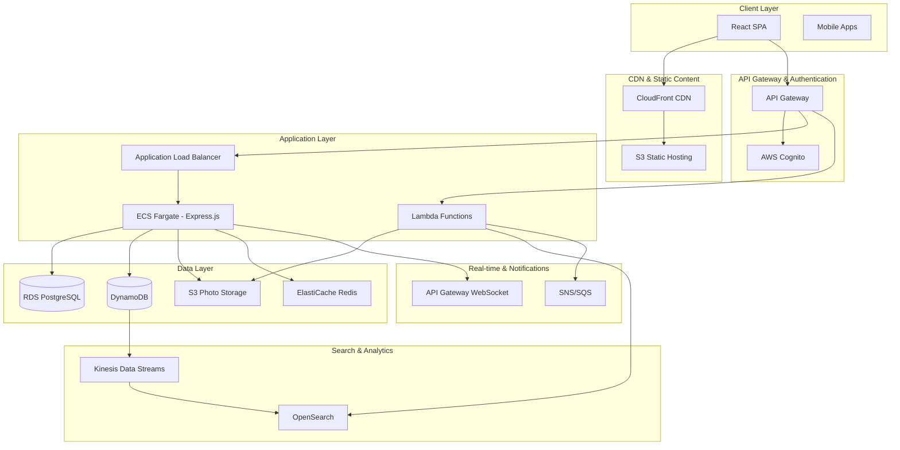

# PhotoShare System Design

A comprehensive system design for a scalable social photo-sharing platform built with React SPA frontend and Express.js backend on AWS.

## Overview

PhotoShare is designed to handle:
- **100,000** daily active users
- **10,000** concurrent sessions  
- **50,000** photo uploads per day
- **<200ms** API response times
- **99.9%** uptime SLA

## System Architecture



## Core Components

### 1. Frontend Architecture
- **React SPA**: Hosted on S3 with CloudFront distribution
- **State Management**: Redux Toolkit for complex state
- **Real-time Updates**: WebSocket connections for live likes/comments
- **Image Optimization**: Client-side compression before upload

### 2. Backend Services
- **API Gateway**: Rate limiting, request/response transformation
- **Express.js on ECS Fargate**: Containerized application layer
- **Lambda Functions**: Serverless image processing and event handling
- **Authentication**: AWS Cognito for user management

### 3. Data Storage Strategy
- **Photos**: S3 with multiple tiers (Standard, IA, Glacier)
- **User Data**: RDS PostgreSQL for ACID compliance
- **Feed Data**: DynamoDB for high-throughput reads
- **Cache**: ElastiCache Redis for session and feed caching
- **Search**: OpenSearch for full-text search capabilities

### 4. Key Features Implementation

#### Photo Upload & Processing
```
User Upload → S3 → Lambda Trigger → Image Processing → Thumbnail Generation → Metadata Storage
```

#### Feed Generation
```
User Action → DynamoDB → DynamoDB Streams → Lambda → OpenSearch Update → Cache Invalidation
```

#### Real-time Engagement
```
Like/Comment → API Gateway WebSocket → Lambda → DynamoDB → Real-time Broadcast
```

## Scalability Features

- **Auto Scaling**: ECS services scale based on CPU/memory metrics
- **Database Scaling**: RDS read replicas, DynamoDB auto-scaling
- **CDN Caching**: CloudFront with optimized cache policies
- **Image Processing**: Lambda concurrent execution scaling
- **Queue Management**: SQS for handling traffic spikes

## Security Implementation

- **Authentication**: JWT tokens via AWS Cognito
- **Authorization**: Fine-grained IAM roles and policies
- **Data Encryption**: 
  - At rest: S3 SSE-KMS, RDS encryption
  - In transit: TLS 1.3 everywhere
- **Network Security**: VPC with private subnets, security groups
- **API Security**: Rate limiting, input validation, CORS policies

## Monitoring & Observability

- **Metrics**: CloudWatch for infrastructure and custom application metrics
- **Logging**: Centralized logging with CloudWatch Logs
- **Tracing**: AWS X-Ray for distributed tracing
- **Alerting**: CloudWatch Alarms with SNS notifications
- **Dashboards**: CloudWatch and custom Grafana dashboards

## Cost Optimization

- **Compute**: Mix of Fargate Spot and On-Demand instances
- **Storage**: S3 Intelligent Tiering for photos
- **Database**: Reserved instances for predictable workloads
- **CDN**: Optimized CloudFront pricing classes
- **Monitoring**: AWS Budgets with automated cost alerts

## Estimated Monthly Costs (US East)

| Service | Estimated Cost |
|---------|---------------|
| ECS Fargate | $200-400 |
| RDS PostgreSQL | $150-300 |
| DynamoDB | $100-200 |
| S3 Storage | $300-500 |
| CloudFront | $50-100 |
| ElastiCache | $100-150 |
| Lambda | $50-100 |
| OpenSearch | $200-300 |
| **Total** | **~$1,150-2,050** |

## Performance Targets

- **API Response Time**: <200ms (P95)
- **Page Load Time**: <3 seconds (P95)
- **Image Upload**: <10 seconds for 10MB files
- **Search Response**: <500ms
- **Feed Refresh**: <1 second

## Deployment Strategy

### CI/CD Pipeline
1. **Source**: GitHub with branch protection
2. **Build**: GitHub Actions or AWS CodeBuild
3. **Test**: Automated unit, integration, and E2E tests
4. **Deploy**: Blue-green deployment via ECS
5. **Monitoring**: Automated rollback on failure

### Infrastructure as Code
- **Terraform** for AWS resource provisioning
- **Docker** for containerization
- **Helm Charts** for Kubernetes deployments (if using EKS)

## Documentation Structure

- [🏗️ Architecture Details](./docs/architecture.md)
- [☁️ AWS Services & Trade-offs](./docs/aws-services.md)
- [📈 Scalability & Caching](./docs/scalability.md)
- [🔒 Security & Compliance](./docs/security.md)
- [🚀 CI/CD & DevOps](./docs/cicd.md)
- [📊 Monitoring & Observability](./docs/monitoring.md)
- [💰 Cost Optimization](./docs/cost-optimization.md)
- [🧪 Testing Strategy](./docs/testing.md)
- [🚨 Disaster Recovery](./docs/disaster-recovery.md)

## Getting Started

1. **Prerequisites**: AWS Account, Terraform, Docker
2. **Setup**: Clone repository and run `terraform init`
3. **Deploy**: Follow deployment guide in `/docs/deployment.md`
4. **Monitor**: Access dashboards and set up alerts

## Contributing

Please read our contributing guidelines and ensure all changes include:
- Architecture decision records (ADRs)
- Updated documentation
- Performance impact analysis
- Security review