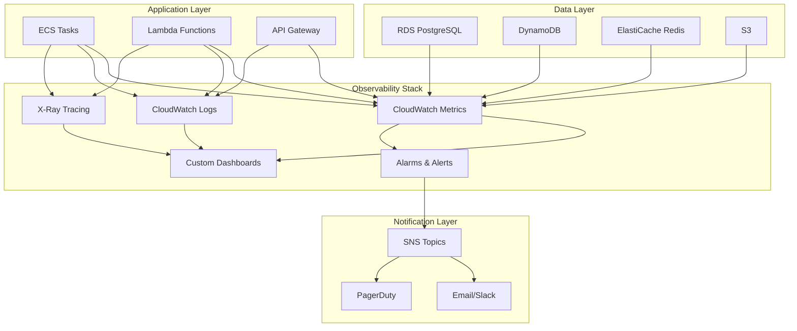

# Monitoring & Observability

## Observability Strategy

PhotoShare implements comprehensive observability across three pillars:
- **Metrics**: Quantitative measurements of system behavior
- **Logs**: Detailed records of system events and errors
- **Traces**: End-to-end request flow through distributed systems

## Monitoring Architecture



## Metrics Collection

### Application Metrics

#### Custom Metrics Implementation
```javascript
// utils/metrics.js
const AWS = require('aws-sdk');
const cloudwatch = new AWS.CloudWatch({ region: process.env.AWS_REGION });

class MetricsCollector {
  constructor() {
    this.namespace = 'PhotoShare/Application';
    this.buffer = [];
    this.flushInterval = 60000; // 1 minute
    
    // Flush metrics periodically
    setInterval(() => this.flush(), this.flushInterval);
  }
  
  // Counter metric (monotonically increasing)
  incrementCounter(metricName, value = 1, dimensions = {}) {
    this.addMetric(metricName, value, 'Count', dimensions);
  }
  
  // Gauge metric (point-in-time value)
  recordGauge(metricName, value, dimensions = {}) {
    this.addMetric(metricName, value, 'None', dimensions);
  }
  
  // Timer metric (duration measurement)
  recordTimer(metricName, duration, dimensions = {}) {
    this.addMetric(metricName, duration, 'Milliseconds', dimensions);
  }
  
  // Histogram metric (distribution of values)
  recordHistogram(metricName, value, dimensions = {}) {
    this.addMetric(metricName, value, 'None', dimensions);
  }
  
  addMetric(metricName, value, unit, dimensions) {
    const metric = {
      MetricName: metricName,
      Value: value,
      Unit: unit,
      Timestamp: new Date(),
      Dimensions: Object.entries(dimensions).map(([key, val]) => ({
        Name: key,
        Value: val
      }))
    };
    
    this.buffer.push(metric);
    
    // Flush if buffer is full
    if (this.buffer.length >= 20) {
      this.flush();
    }
  }
  
  async flush() {
    if (this.buffer.length === 0) return;
    
    const metrics = this.buffer.splice(0, 20); // CloudWatch limit
    
    try {
      await cloudwatch.putMetricData({
        Namespace: this.namespace,
        MetricData: metrics
      }).promise();
    } catch (error) {
      console.error('Failed to send metrics:', error);
      // Re-queue metrics for retry
      this.buffer.unshift(...metrics);
    }
  }
}

const metrics = new MetricsCollector();

// Middleware for automatic request metrics
const metricsMiddleware = (req, res, next) => {
  const startTime = Date.now();
  
  // Track request count
  metrics.incrementCounter('Requests', 1, {
    Method: req.method,
    Route: req.route?.path || req.path,
    Environment: process.env.NODE_ENV
  });
  
  // Track response metrics on finish
  res.on('finish', () => {
    const duration = Date.now() - startTime;
    
    // Response time
    metrics.recordTimer('ResponseTime', duration, {
      Method: req.method,
      Route: req.route?.path || req.path,
      StatusCode: res.statusCode.toString(),
      Environment: process.env.NODE_ENV
    });
    
    // Error rate
    if (res.statusCode >= 400) {
      metrics.incrementCounter('Errors', 1, {
        Method: req.method,
        Route: req.route?.path || req.path,
        StatusCode: res.statusCode.toString(),
        Environment: process.env.NODE_ENV
      });
    }
  });
  
  next();
};

module.exports = { metrics, metricsMiddleware };
```

#### Business Metrics
```javascript
// metrics/business.js
const { metrics } = require('../utils/metrics');

class BusinessMetrics {
  // User engagement metrics
  static trackUserRegistration(source, userType = 'regular') {
    metrics.incrementCounter('Users.Registered', 1, {
      Source: source,
      UserType: userType
    });
  }
  
  static trackUserLogin(userId, deviceType) {
    metrics.incrementCounter('Users.Login', 1, {
      DeviceType: deviceType
    });
    
    // Daily active users (using gauge)
    metrics.recordGauge('Users.DailyActive', 1, {
      Date: new Date().toISOString().split('T')[0]
    });
  }
  
  // Photo lifecycle metrics
  static trackPhotoUpload(userId, fileSize, fileType) {
    metrics.incrementCounter('Photos.Uploaded', 1, {
      FileType: fileType
    });
    
    metrics.recordGauge('Photos.UploadSize', fileSize, {
      FileType: fileType
    });
  }
  
  static trackPhotoView(photoId, viewerUserId) {
    metrics.incrementCounter('Photos.Views', 1);
  }
  
  static trackPhotoLike(photoId, userId) {
    metrics.incrementCounter('Photos.Likes', 1);
  }
  
  static trackPhotoComment(photoId, userId) {
    metrics.incrementCounter('Photos.Comments', 1);
  }
  
  // Search metrics
  static trackSearch(query, resultCount, responseTime) {
    metrics.incrementCounter('Search.Queries', 1);
    metrics.recordGauge('Search.ResultCount', resultCount);
    metrics.recordTimer('Search.ResponseTime', responseTime);
  }
  
  // Feed metrics
  static trackFeedGeneration(userId, photoCount, generationTime) {
    metrics.recordGauge('Feed.PhotoCount', photoCount);
    metrics.recordTimer('Feed.GenerationTime', generationTime);
  }
  
  // Performance metrics
  static trackDatabaseQuery(operation, tableName, duration) {
    metrics.recordTimer('Database.QueryTime', duration, {
      Operation: operation,
      Table: tableName
    });
  }
  
  static trackCacheOperation(operation, hitMiss, duration) {
    metrics.incrementCounter('Cache.Operations', 1, {
      Operation: operation,
      Result: hitMiss
    });
    
    metrics.recordTimer('Cache.ResponseTime', duration, {
      Operation: operation
    });
  }
}

module.exports = BusinessMetrics;
```

### Infrastructure Metrics

#### CloudWatch Dashboards
```yaml
# cloudformation/monitoring.yaml
Resources:
  PhotoShareDashboard:
    Type: AWS::CloudWatch::Dashboard
    Properties:
      DashboardName: PhotoShare-Production
      DashboardBody: !Sub |
        {
          "widgets": [
            {
              "type": "metric",
              "x": 0,
              "y": 0,
              "width": 12,
              "height": 6,
              "properties": {
                "metrics": [
                  ["PhotoShare/Application", "Requests", "Environment", "production"],
                  ["...", "Errors", ".", "."],
                  ["AWS/ApplicationELB", "RequestCount", "LoadBalancer", "${LoadBalancerName}"],
                  ["...", "HTTPCode_ELB_5XX_Count", ".", "."]
                ],
                "period": 300,
                "stat": "Sum",
                "region": "${AWS::Region}",
                "title": "Request Volume & Errors"
              }
            },
            {
              "type": "metric",
              "x": 12,
              "y": 0,
              "width": 12,
              "height": 6,
              "properties": {
                "metrics": [
                  ["PhotoShare/Application", "ResponseTime", "Environment", "production"],
                  ["AWS/ApplicationELB", "TargetResponseTime", "LoadBalancer", "${LoadBalancerName}"]
                ],
                "period": 300,
                "stat": "Average",
                "region": "${AWS::Region}",
                "title": "Response Time"
              }
            },
            {
              "type": "metric",
              "x": 0,
              "y": 6,
              "width": 8,
              "height": 6,
              "properties": {
                "metrics": [
                  ["AWS/ECS", "CPUUtilization", "ServiceName", "${ECSServiceName}", "ClusterName", "${ECSClusterName}"],
                  ["...", "MemoryUtilization", ".", ".", ".", "."]
                ],
                "period": 300,
                "stat": "Average",
                "region": "${AWS::Region}",
                "title": "ECS Resource Utilization"
              }
            },
            {
              "type": "metric",
              "x": 8,
              "y": 6,
              "width": 8,
              "height": 6,
              "properties": {
                "metrics": [
                  ["AWS/RDS", "DatabaseConnections", "DBInstanceIdentifier", "${RDSInstanceId}"],
                  ["...", "CPUUtilization", ".", "."],
                  ["...", "ReadLatency", ".", "."],
                  ["...", "WriteLatency", ".", "."]
                ],
                "period": 300,
                "stat": "Average",
                "region": "${AWS::Region}",
                "title": "Database Performance"
              }
            },
            {
              "type": "metric",
              "x": 16,
              "y": 6,
              "width": 8,
              "height": 6,
              "properties": {
                "metrics": [
                  ["AWS/ElastiCache", "CPUUtilization", "CacheClusterId", "${RedisClusterId}"],
                  ["...", "CacheHits", ".", "."],
                  ["...", "CacheMisses", ".", "."]
                ],
                "period": 300,
                "stat": "Average",
                "region": "${AWS::Region}",
                "title": "Cache Performance"
              }
            },
            {
              "type": "metric",
              "x": 0,
              "y": 12,
              "width": 12,
              "height": 6,
              "properties": {
                "metrics": [
                  ["PhotoShare/Application", "Users.DailyActive"],
                  ["...", "Photos.Uploaded"],
                  ["...", "Photos.Views"],
                  ["...", "Photos.Likes"]
                ],
                "period": 3600,
                "stat": "Sum",
                "region": "${AWS::Region}",
                "title": "Business Metrics"
              }
            },
            {
              "type": "log",
              "x": 12,
              "y": 12,
              "width": 12,
              "height": 6,
              "properties": {
                "query": "SOURCE '/aws/ecs/photoshare-production'\n| fields @timestamp, @message\n| filter @message like /ERROR/\n| sort @timestamp desc\n| limit 20",
                "region": "${AWS::Region}",
                "title": "Recent Errors"
              }
            }
          ]
        }
```

## Distributed Tracing

### X-Ray Integration
```javascript
// utils/tracing.js
const AWSXRay = require('aws-xray-sdk-core');
const AWS = AWSXRay.captureAWS(require('aws-sdk'));

// Configure X-Ray
AWSXRay.config([
  AWSXRay.plugins.EC2Plugin,
  AWSXRay.plugins.ECSPlugin
]);

AWSXRay.middleware.setSamplingRules({
  version: 2,
  default: {
    fixed_target: 1,
    rate: 0.1
  },
  rules: [
    {
      description: "PhotoShare API",
      service_name: "photoshare-api",
      http_method: "*",
      url_path: "/api/*",
      fixed_target: 2,
      rate: 0.2
    }
  ]
});

// Express middleware
const xrayExpress = AWSXRay.express;

// Custom tracing utilities
class TracingUtils {
  static createSubsegment(name, callback) {
    const subsegment = AWSXRay.getSegment().addNewSubsegment(name);
    
    try {
      const result = callback(subsegment);
      
      if (result && typeof result.then === 'function') {
        return result
          .then(data => {
            subsegment.close();
            return data;
          })
          .catch(error => {
            subsegment.addError(error);
            subsegment.close();
            throw error;
          });
      }
      
      subsegment.close();
      return result;
    } catch (error) {
      subsegment.addError(error);
      subsegment.close();
      throw error;
    }
  }
  
  static addAnnotation(key, value) {
    const segment = AWSXRay.getSegment();
    if (segment) {
      segment.addAnnotation(key, value);
    }
  }
  
  static addMetadata(namespace, data) {
    const segment = AWSXRay.getSegment();
    if (segment) {
      segment.addMetadata(namespace, data);
    }
  }
}

// Database tracing wrapper
const tracedQuery = (query, params) => {
  return TracingUtils.createSubsegment('database_query', async (subsegment) => {
    subsegment.addAnnotation('query_type', query.split(' ')[0].toLowerCase());
    subsegment.addMetadata('database', { query, params });
    
    const startTime = Date.now();
    try {
      const result = await pool.query(query, params);
      subsegment.addMetadata('database', { 
        rowCount: result.rowCount,
        duration: Date.now() - startTime
      });
      return result;
    } catch (error) {
      subsegment.addError(error);
      throw error;
    }
  });
};

// Cache tracing wrapper
const tracedCacheOperation = (operation, key, value) => {
  return TracingUtils.createSubsegment('cache_operation', async (subsegment) => {
    subsegment.addAnnotation('cache_operation', operation);
    subsegment.addAnnotation('cache_key', key);
    
    const startTime = Date.now();
    try {
      let result;
      switch (operation) {
        case 'get':
          result = await redis.get(key);
          subsegment.addAnnotation('cache_hit', result !== null);
          break;
        case 'set':
          result = await redis.set(key, value);
          break;
        case 'del':
          result = await redis.del(key);
          break;
      }
      
      subsegment.addMetadata('cache', {
        operation,
        key,
        duration: Date.now() - startTime,
        hit: operation === 'get' && result !== null
      });
      
      return result;
    } catch (error) {
      subsegment.addError(error);
      throw error;
    }
  });
};

module.exports = {
  AWSXRay,
  xrayExpress,
  TracingUtils,
  tracedQuery,
  tracedCacheOperation
};
```

### Request Correlation
```javascript
// middleware/correlation.js
const { v4: uuidv4 } = require('uuid');
const { TracingUtils } = require('../utils/tracing');

const correlationMiddleware = (req, res, next) => {
  // Generate or extract correlation ID
  const correlationId = req.headers['x-correlation-id'] || uuidv4();
  
  // Add to request context
  req.correlationId = correlationId;
  
  // Add to response headers
  res.setHeader('x-correlation-id', correlationId);
  
  // Add to X-Ray trace
  TracingUtils.addAnnotation('correlation_id', correlationId);
  TracingUtils.addMetadata('request', {
    correlationId,
    userAgent: req.headers['user-agent'],
    ip: req.ip,
    method: req.method,
    url: req.url
  });
  
  // Add to all logs
  req.log = require('../utils/logger').child({ correlationId });
  
  next();
};

module.exports = correlationMiddleware;
```

## Logging Strategy

### Structured Logging
```javascript
// utils/logger.js
const winston = require('winston');
const { CloudWatchTransport } = require('winston-cloudwatch');

// Custom format for structured logging
const structuredFormat = winston.format.combine(
  winston.format.timestamp(),
  winston.format.errors({ stack: true }),
  winston.format.json(),
  winston.format.printf(({ timestamp, level, message, ...meta }) => {
    return JSON.stringify({
      timestamp,
      level,
      message,
      service: 'photoshare-api',
      version: process.env.APP_VERSION || '1.0.0',
      environment: process.env.NODE_ENV,
      ...meta
    });
  })
);

// Create logger instance
const logger = winston.createLogger({
  level: process.env.LOG_LEVEL || 'info',
  format: structuredFormat,
  defaultMeta: {
    service: 'photoshare-api',
    environment: process.env.NODE_ENV
  },
  transports: [
    // Console output for development
    new winston.transports.Console({
      format: process.env.NODE_ENV === 'development' 
        ? winston.format.combine(
            winston.format.colorize(),
            winston.format.simple()
          )
        : structuredFormat
    }),
    
    // CloudWatch for production
    ...(process.env.NODE_ENV === 'production' ? [
      new CloudWatchTransport({
        logGroupName: `/aws/ecs/photoshare-${process.env.NODE_ENV}`,
        logStreamName: `api-${process.env.HOSTNAME || 'unknown'}`,
        awsOptions: {
          region: process.env.AWS_REGION
        },
        retentionInDays: 30
      })
    ] : [])
  ],
  
  // Handle uncaught exceptions
  exceptionHandlers: [
    new winston.transports.Console(),
    ...(process.env.NODE_ENV === 'production' ? [
      new CloudWatchTransport({
        logGroupName: `/aws/ecs/photoshare-${process.env.NODE_ENV}-exceptions`,
        logStreamName: `api-${process.env.HOSTNAME || 'unknown'}`,
        awsOptions: {
          region: process.env.AWS_REGION
        }
      })
    ] : [])
  ]
});

// Request logging middleware
const requestLogger = (req, res, next) => {
  const startTime = Date.now();
  
  // Log request start
  req.log = logger.child({
    correlationId: req.correlationId,
    requestId: req.id,
    userId: req.user?.id
  });
  
  req.log.info('Request started', {
    method: req.method,
    url: req.url,
    userAgent: req.headers['user-agent'],
    ip: req.ip,
    contentLength: req.headers['content-length']
  });
  
  // Log response
  res.on('finish', () => {
    const duration = Date.now() - startTime;
    
    req.log.info('Request completed', {
      statusCode: res.statusCode,
      duration,
      contentLength: res.get('content-length')
    });
  });
  
  next();
};

// Error logging
const errorLogger = (error, req, res, next) => {
  req.log.error('Request error', {
    error: error.message,
    stack: error.stack,
    statusCode: error.statusCode || 500
  });
  
  next(error);
};

module.exports = {
  logger,
  requestLogger,
  errorLogger
};
```

### Log Aggregation & Analysis
```javascript
// utils/log-analysis.js
const AWS = require('aws-sdk');
const cloudwatchlogs = new AWS.CloudWatchLogs({ region: process.env.AWS_REGION });

class LogAnalyzer {
  constructor() {
    this.logGroupName = `/aws/ecs/photoshare-${process.env.NODE_ENV}`;
  }
  
  // Query logs for specific patterns
  async queryLogs(query, startTime, endTime) {
    const params = {
      logGroupName: this.logGroupName,
      queryString: query,
      startTime: startTime || Date.now() - (24 * 60 * 60 * 1000), // 24h ago
      endTime: endTime || Date.now()
    };
    
    const startQueryResult = await cloudwatchlogs.startQuery(params).promise();
    const queryId = startQueryResult.queryId;
    
    // Poll for results
    let results;
    do {
      await new Promise(resolve => setTimeout(resolve, 1000)); // Wait 1 second
      results = await cloudwatchlogs.getQueryResults({ queryId }).promise();
    } while (results.status === 'Running');
    
    return results.results;
  }
  
  // Find error patterns
  async findErrorPatterns(hours = 24) {
    const query = `
      fields @timestamp, @message, level, error
      | filter level = "error"
      | stats count() by error
      | sort count desc
      | limit 20
    `;
    
    const startTime = Date.now() - (hours * 60 * 60 * 1000);
    return await this.queryLogs(query, startTime);
  }
  
  // Analyze slow requests
  async findSlowRequests(threshold = 1000, hours = 24) {
    const query = `
      fields @timestamp, @message, duration, url, method
      | filter duration > ${threshold}
      | sort @timestamp desc
      | limit 50
    `;
    
    const startTime = Date.now() - (hours * 60 * 60 * 1000);
    return await this.queryLogs(query, startTime);
  }
  
  // User activity analysis
  async analyzeUserActivity(userId, hours = 24) {
    const query = `
      fields @timestamp, @message, method, url, statusCode
      | filter userId = "${userId}"
      | sort @timestamp desc
    `;
    
    const startTime = Date.now() - (hours * 60 * 60 * 1000);
    return await this.queryLogs(query, startTime);
  }
}

module.exports = LogAnalyzer;
```

## Alerting & Notifications

### CloudWatch Alarms
```yaml
# cloudformation/alarms.yaml
Resources:
  # High Error Rate Alarm
  HighErrorRateAlarm:
    Type: AWS::CloudWatch::Alarm
    Properties:
      AlarmName: PhotoShare-HighErrorRate
      AlarmDescription: High error rate detected
      MetricName: Errors
      Namespace: PhotoShare/Application
      Statistic: Sum
      Period: 300
      EvaluationPeriods: 2
      Threshold: 10
      ComparisonOperator: GreaterThanThreshold
      Dimensions:
        - Name: Environment
          Value: !Ref Environment
      AlarmActions:
        - !Ref CriticalAlertsTopic
      TreatMissingData: notBreaching

  # High Response Time Alarm  
  HighResponseTimeAlarm:
    Type: AWS::CloudWatch::Alarm
    Properties:
      AlarmName: PhotoShare-HighResponseTime
      AlarmDescription: High response time detected
      MetricName: ResponseTime
      Namespace: PhotoShare/Application
      Statistic: Average
      Period: 300
      EvaluationPeriods: 3
      Threshold: 2000
      ComparisonOperator: GreaterThanThreshold
      Dimensions:
        - Name: Environment
          Value: !Ref Environment
      AlarmActions:
        - !Ref WarningAlertsTopic
        
  # Low Cache Hit Rate Alarm
  LowCacheHitRateAlarm:
    Type: AWS::CloudWatch::Alarm
    Properties:
      AlarmName: PhotoShare-LowCacheHitRate
      AlarmDescription: Cache hit rate below threshold
      MetricName: CacheHitRate
      Namespace: PhotoShare/Application
      Statistic: Average
      Period: 600
      EvaluationPeriods: 2
      Threshold: 0.8
      ComparisonOperator: LessThanThreshold
      AlarmActions:
        - !Ref WarningAlertsTopic
        
  # Database Connection Exhaustion
  DatabaseConnectionAlarm:
    Type: AWS::CloudWatch::Alarm
    Properties:
      AlarmName: PhotoShare-DatabaseConnections
      AlarmDescription: High database connection usage
      MetricName: DatabaseConnections
      Namespace: AWS/RDS
      Statistic: Average
      Period: 300
      EvaluationPeriods: 2
      Threshold: 80
      ComparisonOperator: GreaterThanThreshold
      Dimensions:
        - Name: DBInstanceIdentifier
          Value: !Ref RDSInstance
      AlarmActions:
        - !Ref CriticalAlertsTopic
        
  # ECS Service Health
  ECSServiceTaskCountAlarm:
    Type: AWS::CloudWatch::Alarm
    Properties:
      AlarmName: PhotoShare-ECSTaskCount
      AlarmDescription: ECS service running task count too low
      MetricName: RunningTaskCount
      Namespace: AWS/ECS
      Statistic: Average
      Period: 300
      EvaluationPeriods: 1
      Threshold: 1
      ComparisonOperator: LessThanThreshold
      Dimensions:
        - Name: ServiceName
          Value: !Ref ECSService
        - Name: ClusterName
          Value: !Ref ECSCluster
      AlarmActions:
        - !Ref CriticalAlertsTopic
```

### Notification System
```javascript
// utils/notifications.js
const AWS = require('aws-sdk');
const sns = new AWS.SNS({ region: process.env.AWS_REGION });

class NotificationService {
  constructor() {
    this.topics = {
      critical: process.env.CRITICAL_ALERTS_TOPIC_ARN,
      warning: process.env.WARNING_ALERTS_TOPIC_ARN,
      info: process.env.INFO_ALERTS_TOPIC_ARN
    };
  }
  
  async sendAlert(severity, title, message, details = {}) {
    const topicArn = this.topics[severity];
    if (!topicArn) {
      console.error(`No topic configured for severity: ${severity}`);
      return;
    }
    
    const alertMessage = {
      timestamp: new Date().toISOString(),
      severity,
      title,
      message,
      environment: process.env.NODE_ENV,
      service: 'photoshare-api',
      details
    };
    
    try {
      await sns.publish({
        TopicArn: topicArn,
        Subject: `[${severity.toUpperCase()}] PhotoShare: ${title}`,
        Message: JSON.stringify(alertMessage, null, 2)
      }).promise();
      
      console.log(`Alert sent: ${severity} - ${title}`);
    } catch (error) {
      console.error('Failed to send alert:', error);
    }
  }
  
  // Predefined alert types
  async sendHighErrorRateAlert(errorCount, timeWindow) {
    await this.sendAlert('critical', 'High Error Rate Detected', 
      `${errorCount} errors in the last ${timeWindow} minutes`, {
        errorCount,
        timeWindow,
        runbook: 'https://wiki.company.com/photoshare/runbooks/high-error-rate'
      });
  }
  
  async sendSlowResponseAlert(avgResponseTime, threshold) {
    await this.sendAlert('warning', 'Slow API Response Time',
      `Average response time ${avgResponseTime}ms exceeds threshold ${threshold}ms`, {
        avgResponseTime,
        threshold,
        runbook: 'https://wiki.company.com/photoshare/runbooks/slow-response'
      });
  }
  
  async sendDatabaseConnectionAlert(currentConnections, maxConnections) {
    await this.sendAlert('critical', 'Database Connection Pool Exhaustion',
      `${currentConnections}/${maxConnections} database connections in use`, {
        currentConnections,
        maxConnections,
        runbook: 'https://wiki.company.com/photoshare/runbooks/db-connections'
      });
  }
  
  async sendDeploymentAlert(status, version, environment) {
    const severity = status === 'success' ? 'info' : 'critical';
    await this.sendAlert(severity, `Deployment ${status}`,
      `Version ${version} deployment ${status} in ${environment}`, {
        version,
        environment,
        status
      });
  }
}

module.exports = NotificationService;
```

### Health Check System
```javascript
// routes/health.js
const express = require('express');
const router = express.Router();
const { pool } = require('../database');
const redis = require('../redis');
const AWS = require('aws-sdk');
const s3 = new AWS.S3();

// Basic health check
router.get('/', (req, res) => {
  res.json({
    status: 'ok',
    timestamp: new Date().toISOString(),
    version: process.env.APP_VERSION || '1.0.0',
    environment: process.env.NODE_ENV
  });
});

// Detailed health check
router.get('/detailed', async (req, res) => {
  const checks = {
    api: { status: 'ok', timestamp: new Date().toISOString() },
    database: await checkDatabase(),
    cache: await checkCache(), 
    storage: await checkStorage(),
    external: await checkExternalServices()
  };
  
  const overallStatus = Object.values(checks).every(check => check.status === 'ok') 
    ? 'ok' : 'degraded';
  
  res.status(overallStatus === 'ok' ? 200 : 503).json({
    status: overallStatus,
    timestamp: new Date().toISOString(),
    checks
  });
});

// Individual service health checks
router.get('/database', async (req, res) => {
  const result = await checkDatabase();
  res.status(result.status === 'ok' ? 200 : 503).json(result);
});

router.get('/cache', async (req, res) => {
  const result = await checkCache();
  res.status(result.status === 'ok' ? 200 : 503).json(result);
});

router.get('/storage', async (req, res) => {
  const result = await checkStorage();
  res.status(result.status === 'ok' ? 200 : 503).json(result);
});

// Health check implementations
async function checkDatabase() {
  try {
    const start = Date.now();
    const result = await pool.query('SELECT 1 as test');
    const duration = Date.now() - start;
    
    return {
      status: 'ok',
      timestamp: new Date().toISOString(),
      responseTime: duration,
      details: {
        connected: true,
        testQuery: result.rows[0].test === 1
      }
    };
  } catch (error) {
    return {
      status: 'error',
      timestamp: new Date().toISOString(),
      error: error.message,
      details: {
        connected: false
      }
    };
  }
}

async function checkCache() {
  try {
    const start = Date.now();
    await redis.ping();
    const duration = Date.now() - start;
    
    return {
      status: 'ok',
      timestamp: new Date().toISOString(),
      responseTime: duration,
      details: {
        connected: true
      }
    };
  } catch (error) {
    return {
      status: 'error',
      timestamp: new Date().toISOString(),
      error: error.message,
      details: {
        connected: false
      }
    };
  }
}

async function checkStorage() {
  try {
    const start = Date.now();
    await s3.headBucket({ Bucket: process.env.PHOTOS_BUCKET }).promise();
    const duration = Date.now() - start;
    
    return {
      status: 'ok',
      timestamp: new Date().toISOString(),
      responseTime: duration,
      details: {
        bucketAccessible: true
      }
    };
  } catch (error) {
    return {
      status: 'error',
      timestamp: new Date().toISOString(),
      error: error.message,
      details: {
        bucketAccessible: false
      }
    };
  }
}

async function checkExternalServices() {
  // Check external dependencies like third-party APIs
  const checks = {};
  
  // Example: Check image processing service
  try {
    const response = await fetch('https://image-processing-service.com/health');
    checks.imageProcessing = {
      status: response.ok ? 'ok' : 'error',
      responseTime: response.headers.get('x-response-time')
    };
  } catch (error) {
    checks.imageProcessing = {
      status: 'error',
      error: error.message
    };
  }
  
  return checks;
}

module.exports = router;
```

## Performance Monitoring

### Real User Monitoring (RUM)
```javascript
// frontend/monitoring/rum.js
class RealUserMonitoring {
  constructor() {
    this.metrics = [];
    this.sessionId = this.generateSessionId();
    this.userId = null;
    
    // Initialize performance monitoring
    this.initPerformanceObserver();
    this.initErrorTracking();
    this.initUserInteractionTracking();
  }
  
  initPerformanceObserver() {
    if ('PerformanceObserver' in window) {
      // Navigation timing
      const navObserver = new PerformanceObserver((list) => {
        list.getEntries().forEach((entry) => {
          this.recordMetric('navigation', {
            url: entry.name,
            loadTime: entry.loadEventEnd - entry.fetchStart,
            domContentLoaded: entry.domContentLoadedEventEnd - entry.fetchStart,
            firstPaint: entry.loadEventStart - entry.fetchStart
          });
        });
      });
      navObserver.observe({ entryTypes: ['navigation'] });
      
      // Resource timing
      const resourceObserver = new PerformanceObserver((list) => {
        list.getEntries().forEach((entry) => {
          this.recordMetric('resource', {
            name: entry.name,
            duration: entry.duration,
            size: entry.transferSize,
            type: this.getResourceType(entry.name)
          });
        });
      });
      resourceObserver.observe({ entryTypes: ['resource'] });
      
      // Largest Contentful Paint
      const lcpObserver = new PerformanceObserver((list) => {
        list.getEntries().forEach((entry) => {
          this.recordMetric('lcp', {
            value: entry.startTime,
            element: entry.element?.tagName
          });
        });
      });
      lcpObserver.observe({ entryTypes: ['largest-contentful-paint'] });
    }
  }
  
  initErrorTracking() {
    window.addEventListener('error', (event) => {
      this.recordError('javascript', {
        message: event.message,
        filename: event.filename,
        line: event.lineno,
        column: event.colno,
        stack: event.error?.stack
      });
    });
    
    window.addEventListener('unhandledrejection', (event) => {
      this.recordError('promise', {
        reason: event.reason,
        stack: event.reason?.stack
      });
    });
  }
  
  initUserInteractionTracking() {
    // Track clicks on important elements
    document.addEventListener('click', (event) => {
      const element = event.target;
      if (element.matches('button, a, [data-track]')) {
        this.recordInteraction('click', {
          element: element.tagName,
          text: element.textContent?.substring(0, 50),
          dataTrack: element.dataset.track
        });
      }
    });
    
    // Track form submissions
    document.addEventListener('submit', (event) => {
      this.recordInteraction('form_submit', {
        form: event.target.id || event.target.className
      });
    });
  }
  
  recordMetric(type, data) {
    this.metrics.push({
      type,
      timestamp: Date.now(),
      sessionId: this.sessionId,
      userId: this.userId,
      url: window.location.href,
      userAgent: navigator.userAgent,
      data
    });
    
    this.flushMetrics();
  }
  
  recordError(type, data) {
    this.recordMetric('error', { errorType: type, ...data });
  }
  
  recordInteraction(type, data) {
    this.recordMetric('interaction', { interactionType: type, ...data });
  }
  
  async flushMetrics() {
    if (this.metrics.length >= 10) {
      const metricsToSend = this.metrics.splice(0, 10);
      
      try {
        await fetch('/api/metrics/rum', {
          method: 'POST',
          headers: { 'Content-Type': 'application/json' },
          body: JSON.stringify({ metrics: metricsToSend })
        });
      } catch (error) {
        console.error('Failed to send RUM metrics:', error);
        // Re-queue metrics for retry
        this.metrics.unshift(...metricsToSend);
      }
    }
  }
  
  setUserId(userId) {
    this.userId = userId;
  }
  
  generateSessionId() {
    return 'session_' + Math.random().toString(36).substr(2, 9);
  }
  
  getResourceType(url) {
    if (url.match(/\.(jpg|jpeg|png|gif|webp)$/i)) return 'image';
    if (url.match(/\.(css)$/i)) return 'stylesheet';
    if (url.match(/\.(js)$/i)) return 'script';
    if (url.match(/\.(woff|woff2|ttf)$/i)) return 'font';
    return 'other';
  }
}

// Initialize RUM
const rum = new RealUserMonitoring();
window.PhotoShareRUM = rum;
```

### Synthetic Monitoring
```javascript
// monitoring/synthetic.js
const puppeteer = require('puppeteer');
const { metrics } = require('../utils/metrics');

class SyntheticMonitoring {
  constructor() {
    this.browser = null;
    this.baseUrl = process.env.BASE_URL || 'https://photoshare.com';
  }
  
  async init() {
    this.browser = await puppeteer.launch({
      headless: true,
      args: ['--no-sandbox', '--disable-setuid-sandbox']
    });
  }
  
  async runHealthCheck() {
    const page = await this.browser.newPage();
    
    try {
      const startTime = Date.now();
      
      // Navigate to homepage
      await page.goto(this.baseUrl, { waitUntil: 'networkidle0' });
      
      const loadTime = Date.now() - startTime;
      
      // Check if critical elements are present
      const criticalElements = await page.evaluate(() => {
        return {
          hasHeader: !!document.querySelector('header'),
          hasLoginButton: !!document.querySelector('[data-testid="login-button"]'),
          hasPhotoFeed: !!document.querySelector('[data-testid="photo-feed"]')
        };
      });
      
      metrics.recordTimer('Synthetic.PageLoad', loadTime, {
        Page: 'Homepage',
        Environment: process.env.NODE_ENV
      });
      
      metrics.recordGauge('Synthetic.ElementsPresent', 
        Object.values(criticalElements).filter(Boolean).length, {
        Page: 'Homepage'
      });
      
      return {
        success: true,
        loadTime,
        criticalElements
      };
      
    } catch (error) {
      metrics.incrementCounter('Synthetic.Errors', 1, {
        Page: 'Homepage',
        Error: error.message
      });
      
      throw error;
    } finally {
      await page.close();
    }
  }
  
  async runUserJourney() {
    const page = await this.browser.newPage();
    
    try {
      // User registration journey
      await this.testUserRegistration(page);
      
      // Photo upload journey  
      await this.testPhotoUpload(page);
      
      // Feed browsing journey
      await this.testFeedBrowsing(page);
      
    } finally {
      await page.close();
    }
  }
  
  async testUserRegistration(page) {
    const startTime = Date.now();
    
    await page.goto(`${this.baseUrl}/register`);
    
    // Fill registration form
    await page.type('[data-testid="email-input"]', 'test@example.com');
    await page.type('[data-testid="password-input"]', 'TestPassword123!');
    await page.type('[data-testid="confirm-password-input"]', 'TestPassword123!');
    
    // Submit form
    await page.click('[data-testid="register-button"]');
    
    // Wait for success or error
    await page.waitForSelector('[data-testid="registration-result"]', { timeout: 10000 });
    
    const duration = Date.now() - startTime;
    
    metrics.recordTimer('Synthetic.UserRegistration', duration, {
      Environment: process.env.NODE_ENV
    });
  }
  
  async testPhotoUpload(page) {
    const startTime = Date.now();
    
    // Assume user is logged in from previous test
    await page.goto(`${this.baseUrl}/upload`);
    
    // Upload a test image
    const fileInput = await page.$('[data-testid="file-input"]');
    await fileInput.uploadFile('./test-images/sample.jpg');
    
    // Fill metadata
    await page.type('[data-testid="title-input"]', 'Synthetic Test Photo');
    await page.type('[data-testid="description-input"]', 'Test description');
    
    // Submit upload
    await page.click('[data-testid="upload-button"]');
    
    // Wait for upload completion
    await page.waitForSelector('[data-testid="upload-success"]', { timeout: 30000 });
    
    const duration = Date.now() - startTime;
    
    metrics.recordTimer('Synthetic.PhotoUpload', duration, {
      Environment: process.env.NODE_ENV
    });
  }
  
  async cleanup() {
    if (this.browser) {
      await this.browser.close();
    }
  }
}

// Schedule synthetic monitoring
const runSyntheticChecks = async () => {
  const monitor = new SyntheticMonitoring();
  
  try {
    await monitor.init();
    
    // Run health check every 5 minutes
    setInterval(async () => {
      try {
        await monitor.runHealthCheck();
        console.log('Synthetic health check completed');
      } catch (error) {
        console.error('Synthetic health check failed:', error);
      }
    }, 5 * 60 * 1000);
    
    // Run user journey every 30 minutes
    setInterval(async () => {
      try {
        await monitor.runUserJourney();
        console.log('Synthetic user journey completed');
      } catch (error) {
        console.error('Synthetic user journey failed:', error);
      }
    }, 30 * 60 * 1000);
    
  } catch (error) {
    console.error('Failed to initialize synthetic monitoring:', error);
  }
};

module.exports = { SyntheticMonitoring, runSyntheticChecks };
```